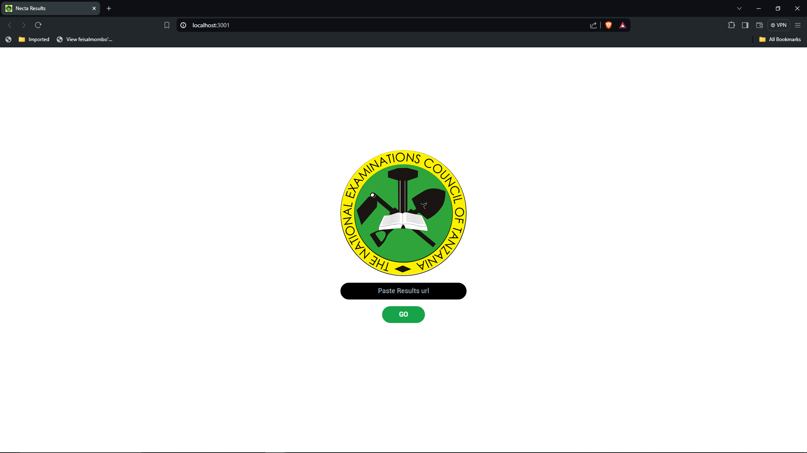
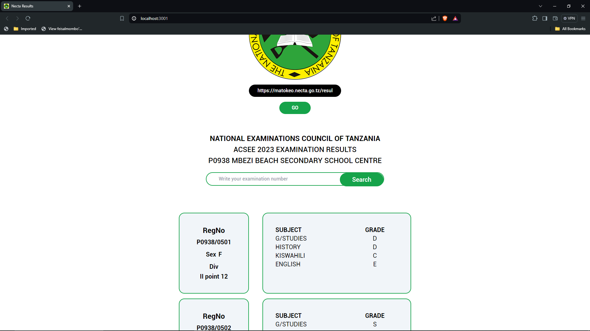
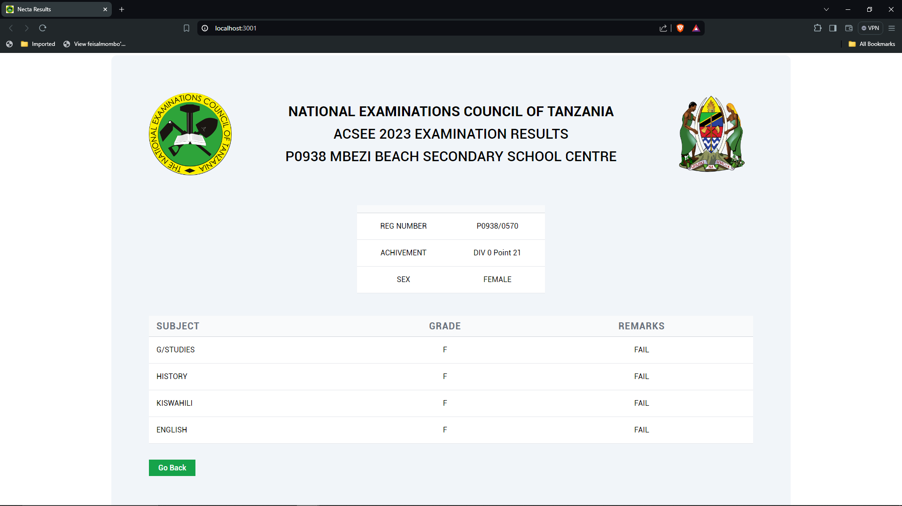

# NECTA Results Platform

## About the Project

In Tanzania, when national results are released, it becomes challenging for students to showcase their results. As a developer, I created a simple web platform to help students display their NECTA results to their parents, relatives, or even friends. The main goal of this project is to assist students in showcasing their results easily and effectively.

This project was created using React for the frontend and a web scraper as the backend, serving as a data provider for the frontend.

## Features

- **Student Result Showcase**: Allows students to easily display their NECTA results.
- **User-Friendly Interface**: Simple and intuitive interface for both students and viewers.
- **Responsive Design**: Ensures the platform is accessible on various devices.

## Screenshots

### Home Page



### Results Page



### Individuat Results Page



## Getting Started

To get a local copy up and running, follow these simple steps.

### Prerequisites

- Node.js
- npm
- Express

### Installation

1. Clone the repository:

   ```sh
   git clone https://github.com/Mhando-Z/Necta-Results.git
   ```

2. Navigate to the project directory:

   ```sh
   cd nectaresults
   ```

3. Install the required dependencies for the frontend and backend:
   ```sh
   npm install
   ```

### Usage

1. If you don't have Node.js and npm installed, please install them from [Node.js official website](https://nodejs.org/).

2. Start the backend server:

   ```sh
   node server.js
   ```

3. Open another terminal in the same directory and start the React app:

   ```sh
   npm start
   ```

4. Visit the NECTA results website and select your respective school results section. Copy the link.

5. Go back to the NECTA Results Showcase project, paste the link, and press "Go". The results will be shown.

## Contributing

Contributions are what make the open source community such an amazing place to learn, inspire, and create. Any contributions you make are **greatly appreciated**.

1. Fork the Project
2. Create your Feature Branch (`git checkout -b feature/AmazingFeature`)
3. Commit your Changes (`git commit -m 'Add some AmazingFeature'`)
4. Push to the Branch (`git push origin feature/AmazingFeature`)
5. Open a Pull Request

## License

Distributed under the MIT License. See `LICENSE` for more information.

## Contact

Your Name - [Mhando Zuberi](https://www.linkedin.com/in/mhando-zuberi-50b6a3248/) - mhandosz17@gmail.com

Project Link: [https://github.com/Mhando-Z/Necta-Results.git](https://github.com/Mhando-Z/Necta-Results.git)
